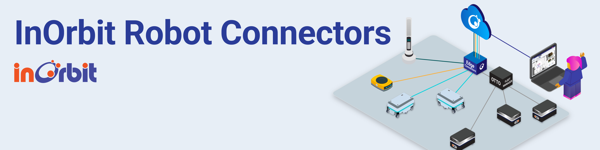

# InOrbit Robot Connectors

This repository hosts a collection of Connectors that communicate with the *InOrbit Platform* on behalf of robots by means of the [InOrbit Python Edge SDK](https://github.com/inorbit-ai/edge-sdk-python). Its goal is to group ready to use Connectors for different robot vendors or types, easing the integration between *InOrbit* and any other robot software.

## Connectors

The following Connectors are included in this repository:

### OTTO Motors

The [InOrbit](https://inorbit.ai/) Robot Connector for [OTTO Motors](https://directory.inorbit.ai/connect/OTTO-Motors) AMRs. Making use of the OTTO Fleet Manager's WebSocket and REST APIs, it allows integrating OTTO robots with your fleet on InOrbit, unlocking interoperability.

A single instance of the Connector is capable of controlling multiple robots.

Check the [README](otto_connector/README.md) for more details on requirements and how to set it up.

### Mobile Industrial Robots (MiR)

The [InOrbit](https://inorbit.ai/) Robot Connector for [Mobile Industrial Robots](https://directory.inorbit.ai/connect/Mobile-Industrial-Robots-A/S) AMRs.

It is a single robot connector, meaning one instance of it per robot in the fleet must be deployed, allowing for grater resiliency and robustness of the fleet integration. The connector makes use of the MiR REST and WebSocket APIs on each robot to make possible the integration and enable interoperability.

Take a look at its [README](mir_connector/README.md) for more details.

### Gausium Robotics

The [InOrbit](https://inorbit.ai/) Connector for [Gausium](https://gausium.com/) robots.

Similar to the MiR connector, it is a single robot connector, meaning one instance of it per robot in the fleet must be deployed, allowing for grater resiliency and robustness of the fleet integration. The connector makes use of the Gaussian Cloud API, which also works while configured to run locally, to make possible the integration and enable interoperability.

Take a look at its [README](gausium_connector/README.md) for more details.

### Instock ASRS

The [InOrbit](https://inorbit.ai/) Connector for the [Instock](https://instock.com/) ASRS. Making use of Instock REST
API and InOrbit's Edge SDK, the Connector allows the integration of Instock ASRS with your fleet on InOrbit, unlocking
interoperability.

A single instance of the Connector is capable of controlling an entire Instock ASRS.

Take a look at its [README](instock_connector/README.md) for more details.

## Development

See [CONTRIBUTING.md](CONTRIBUTING.md) for information related to developing the code.

