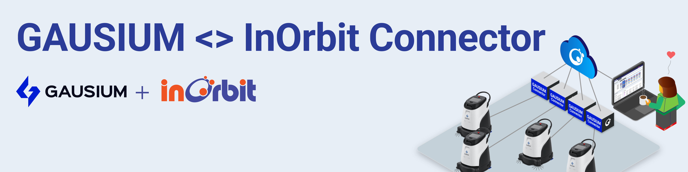

<!--
SPDX-FileCopyrightText: 2025 InOrbit, Inc.

SPDX-License-Identifier: MIT
-->

# Gausium <> InOrbit Connector



[](https://github.com/inorbit-ai/inorbit-robot-connectors/actions)

## Overview

This repository contains the [InOrbit](https://inorbit.ai/) Robot Connector for [Gausium](https://gausium.com/) robots. Making use of the Gaussian Cloud API, which also works while configured to run locally, the Connector allows the integration of Gausium robots with your fleet on InOrbit, unlocking interoperability.

This integration requires the Connector to be configured following the instructions below. A single instance of the Connector is capable of controlling a single robot.

So far tested with:

- [X] Gaussian VC 40 Pro firmware version 3.22.4

## Features

* TODO

## Requirements

-   Python 3.10 or later.
-   InOrbit account [(it's free to sign up!)](https://control.inorbit.ai/ "InOrbit").

## Setup

1. Create a Python virtual environment in the host machine and install the connector.

```shell
virtualenv venv
source venv/bin/activate
pip install -e .
```

2. Configure the Connector:

-   Copy `config/example.yaml` and change the example `robot_id`. This is going to be the InOrbit robot ID. If you plan to deploy multiple robots on a production environment, please contact [support@inorbit.ai](support@inorbit.ai) for allocating a pool of robot IDs for your fleet.

-   Copy `config/example.env` to `config/.env` and set the environment variables following the instructions in the same file.
    You can get the `INORBIT_KEY` for your account from InOrbit's [Developer Console](https://developer.inorbit.ai/docs#configuring-environment-variables).

## Deployment

Once all dependencies are installed and the configuration is complete, the Connector can be run as a bash command.
With the Python virtual environment activated run `inorbit_gausium_connector` to see get instructions on how to run the connector. e.g.:

```bash
inorbit_gausium_connector -c config/example.yaml -id my-example-robot
```

Environment variables will be loaded from `config/.env` if it exists. Otherwise, they can be set manaully.

### Docker

> [!TIP]
> The Connector may also be run as a containerized application. See [`docker/README.md`](docker/README.md) for instructions.

## Next steps

Now that all of your Gausium robots are InOrbit connected, visit the [config as code examples](cac_examples/README.md)
to apply the configuration needed to unlock the full potential of the Gausium <> InOrbit Connector. Please note that the features available on your account will depend on your [InOrbit Edition](https://www.inorbit.ai/pricing). Don't hesitate to contact [support@inorbit.ai](support@inorbit.ai) for more information.

## Contributing

Any contribution that you make to this repository will be under the MIT license, as dictated by that [license](https://opensource.org/licenses/MIT).

Please refer to the [CONTRIBUTING.md](CONTRIBUTING.md) file for information on how to contribute to this project.


