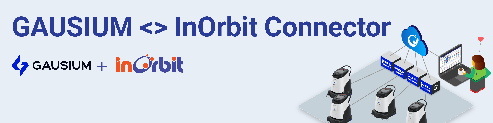

<!--
SPDX-FileCopyrightText: 2025 InOrbit, Inc.

SPDX-License-Identifier: MIT
-->

# InOrbit <> Gausium Open Platform Connector



[](https://github.com/inorbit-ai/inorbit-robot-connectors/actions)

InOrbit Connector for Gausium robots managed by [Gausium Open Platform](https://developer.gs-robot.com/en_US/General%20Introduction).

This connector is built on top of the [`inorbit-connector`](https://github.com/inorbit-ai/inorbit-connector-python/) Python framework, which provides the base structure for developing InOrbit robot connectors using InOrbit's Edge SDK.

This integration requires the Connector to be configured following the instructions below. A single instance of the Connector is capable of controlling a single robot.

So far tested with the following robots:
- Phantas S
- Scrubber 50
- Omnie (TODO: Officially add support for this robot by including it in the `CONNECTOR_TYPES` list of [`connector_model.py`](inorbit_gausium_connector/config/connector_model.py))

## Features

* TODO

## Requirements

- Docker or Python 3.12 or later.
- InOrbit account [(it's free to sign up!)](https://control.inorbit.ai/ "InOrbit").
- Developer access to a Gausium robot managed by Gausium Open Platform.

## Setup

1. Create a Python virtual environment in the host machine and install the connector.

```shell
virtualenv venv
source venv/bin/activate
pip install -e .
```

2. Configure the Connector:

- Copy `config/example.yaml` and change the example `robot_id`. This is going to be the InOrbit robot ID. If you plan to deploy multiple robots on a production environment, please contact [support@inorbit.ai](support@inorbit.ai) for allocating a pool of robot IDs for your fleet.

- Copy `config/example.env` to `config/.env` and set the environment variables following the instructions in the same file.
  You can get the `INORBIT_API_KEY` for your account from InOrbit's [Developer Console](https://developer.inorbit.ai/docs#configuring-environment-variables).
  - For issuing API credentials for the Gausium Open Platform APIs, follow the instructions in the developer portal at [https://developer.gs-robot.com/en_US/General%20Introduction](https://developer.gs-robot.com/en_US/General%20Introduction).

## Deployment

Once all dependencies are installed and the configuration is complete, the Connector can be run as a bash command.
With the Python virtual environment activated run `inorbit_gausium_connector` to get instructions on how to run the connector. e.g.:

```bash
inorbit_gausium_connector -c config/example.yaml -id phantas-1
```

Environment variables will be loaded from `config/.env` if it exists. Otherwise, they can be set manually.

### Docker

> [!TIP]
> The Connector may also be run as a containerized application. See [`docker/README.md`](docker/README.md) for instructions.
>
> We recommend using docker compose for managing multiple connector instances. See [`docker/examples/README.md`](docker/examples/README.md) for a complete deployment example with multiple robots.

## Next steps

Now that all of your Gausium robots are InOrbit connected, visit the [config as code examples](cac_examples/README.md)
to apply the configuration needed to unlock the full potential of the Gausium <> InOrbit Connector. Please note that the features available on your account will depend on your [InOrbit Edition](https://www.inorbit.ai/pricing). Don't hesitate to contact [support@inorbit.ai](support@inorbit.ai) for more information.

## Contributing

Any contribution that you make to this repository will be under the MIT license, as dictated by that [license](https://opensource.org/licenses/MIT).

Please refer to the [CONTRIBUTING.md](CONTRIBUTING.md) file for information on how to contribute to this project.


