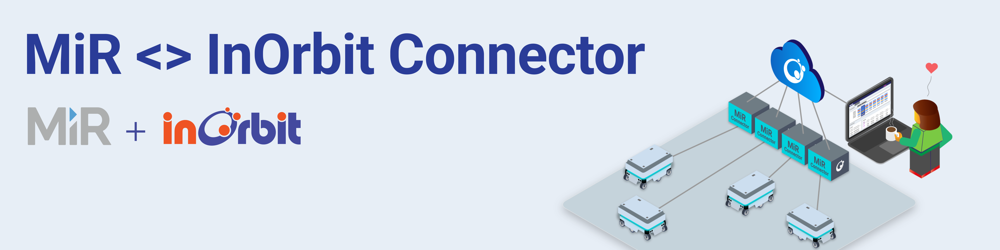

<!--
SPDX-FileCopyrightText: 2023 InOrbit, Inc.

SPDX-License-Identifier: MIT
-->

# MIR <> InOrbit Connector



[](https://github.com/inorbit-ai/inorbit-robot-connectors/actions)

## Overview

This repository contains the [InOrbit](https://inorbit.ai/) Robot Connector for [MiR Motors](https://directory.inorbit.ai/connect/Mobile-Industrial-Robots-A/S) AMRs. Making use of MiR REST APIs as well as InOrbit's [Edge SDK](https://developer.inorbit.ai/docs#edge-sdk), the Connector allows the integration of MiR robots with your fleet on InOrbit, unlocking interoperability.

This integration requires the Connector to be configured following the instructions below. A single instance of the Connector is capable of controlling a single robot.

## Features

By integrating InOrbit's Python Edge SDK with MiR's APIs, the Connector unlocks the following key features on InOrbit's platform:

-   Visualizing: robot pose, system and sub-system status, and battery charge.
-   Camera feed integration.
-   Using [Actions](https://developer.inorbit.ai/docs#configuring-action-definitions) to interact with MiR's API by:

    -   Dispatching Mission.
    -   Controlling Mission status (pause, cancel, retry, etc.).
    -   Dispatching simple Send robot to target missions.

-   Running custom shell scripts on the connector via Custom Actions.
-   [Mission Tracking](https://developer.inorbit.ai/docs#configuring-mission-tracking) support.

## Requirements

-   Python 3.7 or later.
-   InOrbit account [(it's free to sign up!)](https://control.inorbit.ai/ "InOrbit").

## Setup

Create a new folder and a Python virtual environment in the host machine.

```sh
MY_INORBIT_ID="$(date +%N)"
echo "Using INORBIT_ID '${MY_INORBIT_ID}'. Take note of it as it will be used below."
mkdir -p "mir-connector-${MY_INORBIT_ID}" && cd "mir-connector-${MY_INORBIT_ID}"
virtualenv venv/
. venv/bin/activate
mkdir config/
```

There are two alternatives for installing the connector Python package.

1. From PyPi: `pip install inorbit-mir-connector`.
2. From source: clone the repository and run `pip install -e mir_connector/`.

Configure the Connector:

-   Copy `config/my_fleet.example.yaml` and modify the `robot_id` (e.g. `mir100-1`) with the one generated on the previous step. Note that the configuration file supports adding multiple robots, so it's advised copying it to a directory outside of the `mir-connector-${MY_INORBIT_ID}` folder. If you plan to deploy multiple robots on a production environment, please contact [support@inorbit.ai](support@inorbit.ai) for allocating a pool of robot IDs for your fleet.

-   Copy `config/example.env` to `config/.env` and set the environment variables following the instructions in the same file.
    You can get the `INORBIT_KEY` for your account from InOrbit's [Developer Console](https://developer.inorbit.ai/docs#configuring-environment-variables).

-   Also apply the Configuration as Code manifests under the `cac_examples` folder, through the [InOrbit CLI](https://developer.inorbit.ai/docs#using-the-inorbit-cli).

## Deployment

Once all dependencies are installed and the configuration is complete, the Connector can be run as a bash command.
With the Python virtual environment activated run `inorbit-mir100-connector -c <path to config.yaml> -id <robot_id>`:

```sh
# Add the environment variables, activate the virtual environment and run the Connector
export $(grep -v '^#' config/.env | xargs) && \
inorbit-mir100-connector -c ../my_fleet.example.yaml -id ${MY_INORBIT_ID}
```

### Systemd

It is recommended to run the Connector as a service. An example [systemd](https://www.freedesktop.org/software/systemd/man/systemd.service.html) service unit configuration is provided at [`systemd/mir-connector.service`](systemd/mir-connector.service).
In a Debian based system the service can usually be installed and enabled at boot the following way:

```sh
# Copy the unit configuration to the service directory
sudo cp /path/to/systemd/mir-connector.service /etc/systemd/system/mir-connector-${MY_INORBIT_ID}.service
# Replace the robot_id, path to the connector directory and configuration file
sudo vi /etc/systemd/system/mir-connector-${MY_INORBIT_ID}.service
# Reload the daemon and enable the service
sudo systemctl daemon-reload
sudo systemctl enable mir-connector-${MY_INORBIT_ID}
```

Once the service is installed, it can be restarted with:

```sh
sudo systemctl restart mir-connector-${MY_INORBIT_ID}
```

and its logs can be seen by running:

```sh
sudo journalctl --unit=mir-connector-${MY_INORBIT_ID} --since=today --follow
```

### Docker

The Connector may also be run on docker containers. See [`docker/README.md`](docker/README.md) for instructions.

## Next steps

Now that all of your MiR robots are InOrbit connected, visit the [config as code examples](cac_examples/README.md)
to apply the configuration needed to unlock the full potential of the MiR <> InOrbit Connector. Please note that the features available on your account will depend on your [InOrbit Edition](https://www.inorbit.ai/pricing). Don't hesitate to contact [support@inorbit.ai](support@inorbit.ai) for more information.

## Contributing

Any contribution that you make to this repository will be under the MIT license, as dictated by that [license](https://opensource.org/licenses/MIT).

### Run formatting and lint checks

To make sure that the code is formatted and linted correctly, having installed the `dev` set of requirements run

```bash
black . --line-length=100 --exclude venv
flake8 --max-line-length=100 --exclude venv
```

### Run unit tests

```bash
# Create the virtualenv if not active already
virtualenv venv/
. venv/bin/activate
pip install -e '.[dev]'
pytest -v
```

## Version Bump

Having installed the `dev` set of requirements, to update the version number, commit the changes and create a tag run the following:

```bash
bump-my-version bump minor # Options: major, minor, patch
```

To prevent changes from being applied, use

```bash
bump-my-version bump minor --dry-run --verbose
```

### Build and publish the package

New releases are built and published to PyPi automatically by GitHub Actions when a new version bump commit is pushed.

> _Note:_ The message of the last commit must contain "Bump version" for the publish job to run. e.g. "Bump version: 1.0.0 -> 1.0.1"

To manually build and publish the package to https://test.pypi.org/, run:

```bash
pip install .[dev] # Install dependencies
python -m build --sdist # Build the package
twine check dist/* # Run checks
twine upload --repository testpypi dist/* # Upload to test PyPI. $HOME/.pypirc should exist and contain the api tokens. See https://pypi.org/help/#apitoken
```


