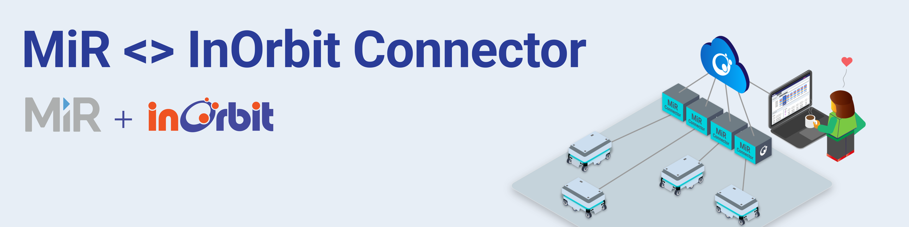

<!--
SPDX-FileCopyrightText: 2023 InOrbit, Inc.

SPDX-License-Identifier: MIT
-->

# MiR ↔ InOrbit Connector



[](https://github.com/inorbit-ai/inorbit-robot-connectors/actions)

## Overview

The [InOrbit](https://inorbit.ai/) Robot Connector for [MiR Motors](https://directory.inorbit.ai/connect/Mobile-Industrial-Robots-A/S) AMRs integrates MiR robots with InOrbit's fleet management platform. Using MiR's REST APIs and InOrbit's [Edge SDK](https://developer.inorbit.ai/docs#edge-sdk), this connector enables seamless robot fleet management and monitoring.

**🔧 One Connector Per Robot**: Each MiR robot requires its own connector instance for optimal performance and isolation. The connector supports simplified fleet-wide configuration with per-robot overrides.

## ✨ Features

- **Real-time Monitoring**: Robot pose, system status, battery levels, and error states
- **Mission Control**: Dispatch, pause, cancel missions via [Actions](https://developer.inorbit.ai/docs#configuring-action-definitions), including [running MiR robot actions as mission steps](#-running-mir-actions-in-missions)
- **Custom Scripts**: Execute custom shell scripts on the connector via Custom Actions
- **Mission Tracking**: Full [Mission Tracking](https://developer.inorbit.ai/docs#configuring-mission-tracking) support
- **SSL Support**: Secure connections with full certificate validation
- **Multi-Robot Fleet Management**: Simplified configuration for managing multiple robots
- **Docker Support**: Production-ready containerized deployment with Docker Compose

## 📋 Requirements

- **Python 3.7+** with SQLite3 support (included in most distributions)
- **InOrbit Account** [(free signup)](https://control.inorbit.ai/)
- **MiR Robot** with REST API access
- **Network Access** between connector host and MiR robot

## 🚀 Quick Start

### 1. Clone and Setup

<details>
<summary><b>🐧 Linux/macOS</b></summary>

```bash
# Clone the repository
git clone https://github.com/inorbit-ai/inorbit-robot-connectors.git
cd inorbit-robot-connectors/mir_connector

# Create virtual environment
python3 -m venv venv

# Activate virtual environment
source venv/bin/activate

# Verify activation (should show venv path)
which python
```
</details>

<details>
<summary><b>🪟 Windows</b></summary>

```cmd
# Clone the repository
git clone https://github.com/inorbit-ai/inorbit-robot-connectors.git
cd inorbit-robot-connectors/mir_connector

# Create virtual environment
python -m venv venv

# Activate virtual environment
venv\Scripts\activate

# Verify activation (should show venv path)
where python
```
</details>

### 2. Install the Connector

```bash
# Install the connector (venv should be active from step 1)
pip install -e .
```

### 3. Set Up Credentials

**Copy and edit the environment file:**

<details>
<summary><b>🐧 Linux/macOS</b></summary>

```bash
# Copy the example file
cp config/example.env config/.env

# Edit with your actual credentials
nano config/.env

# Load the environment variables
source config/.env

# Verify variables are set
echo $INORBIT_API_KEY
echo $INORBIT_MIR_MIR_USERNAME
echo $INORBIT_MIR_MIR_PASSWORD
```
</details>

<details>
<summary><b>🪟 Windows</b></summary>

```cmd
# Copy the example file
copy config\example.env config\.env

# Edit with your actual credentials
notepad config\.env

# Set the environment variables manually (simplest approach)
set INORBIT_API_KEY=your-actual-api-key
set INORBIT_MIR_MIR_USERNAME=admin
set INORBIT_MIR_MIR_PASSWORD=your-actual-password

# Verify variables are set
echo %INORBIT_API_KEY%
echo %INORBIT_MIR_MIR_USERNAME%
echo %INORBIT_MIR_MIR_PASSWORD%
```
</details>

**Required credentials:**
- **InOrbit API Key**: Get from [InOrbit Developer Console](https://developer.inorbit.ai/docs#configuring-environment-variables)
- **MiR Username/Password**: Your MiR robot's web interface credentials
- **InOrbit Robot Key** (optional): Set as the top-level `inorbit_robot_key` in the config file. It is connector-wide, so a robot that needs its own InOrbit Connect key requires its own config file (a `fleet` of one). Omit it to authenticate with the account `INORBIT_API_KEY` instead.


### 4. Configuration

The connector uses a **single configuration file** with fleet-wide defaults and per-robot overrides. We provide two example configurations:

- **`config/fleet.simple.example.yaml`** - Minimal setup for basic configurations
- **`config/fleet.example.yaml`** - Comprehensive example with advanced features (SSL, database, etc.)

<details>
<summary><b>🐧 Linux/macOS Setup</b></summary>

```bash
# For basic setup (recommended for first-time users)
cp config/fleet.simple.example.yaml config/my_fleet.yaml

# OR for advanced setup (SSL, cameras, etc.)
cp config/fleet.example.yaml config/my_fleet.yaml

# Edit the configuration for your robots
nano config/my_fleet.yaml  # or vim, code, etc.
```
</details>

<details>
<summary><b>🪟 Windows Setup</b></summary>

```cmd
# For basic setup (recommended for first-time users)
copy config\fleet.simple.example.yaml config\my_fleet.yaml

# OR for advanced setup (SSL, cameras, etc.)
copy config\fleet.example.yaml config\my_fleet.yaml

# Edit the configuration for your robots
notepad config\my_fleet.yaml
```
</details>

The configuration file follows the flat inorbit-connector framework schema:
- **Top-level framework fields**: `connector_type: mir`, `location_tz`,
  `update_freq`, `logging:`, optional `metrics:`, optional `inorbit_robot_key`.
- **`connector_config:` block**: fleet-shared MiR settings (`mir_api_version`,
  and `mir_username`/`mir_password`, which are normally omitted and injected
  via environment variables).
- **`fleet:` list**: one entry per robot, each with that robot's connection
  details (`robot_id`, `mir_model`, `mir_host_address`, `mir_host_port`,
  `mir_firmware_version`, `mir_use_ssl`, SSL options, mission group/database
  settings, etc.).

Each connector process serves ONE robot, selected with `-id <robot_id>` (which
must match a `fleet` entry). Both example files include detailed comments
explaining each setting.

### Migrating from 1.x

The connector now uses the flat inorbit-connector framework schema and loads
config with `ConnectorConfig(**read_yaml(path))`. The old custom loader (with a
`common:` section, per-robot-key inheritance, and `${VAR}` expansion) has been
removed. Existing config files need the following changes:

- `connector_type` stays `mir` (the connector identity).
- The `common:`/inheritance structure is gone. Move fleet-shared settings
  (`mir_api_version`, and `mir_username`/`mir_password` if you keep them in
  the file) into a `connector_config:` block.
- Per-robot settings — `mir_model`, `mir_host_address`, `mir_host_port`,
  `mir_firmware_version`, `mir_use_ssl` and the other SSL options, mission
  group/database settings — now live as entries under a `fleet:` list, one
  list item per robot. Robot selection is still `-id <robot_id>`.
- `${VAR}` expansion in the YAML is no longer supported. Set credentials as
  real environment variables instead: `INORBIT_API_KEY` (InOrbit account key),
  `INORBIT_MIR_MIR_USERNAME` and `INORBIT_MIR_MIR_PASSWORD` (MiR robot
  credentials). Any `connector_config` field can be overridden with
  `INORBIT_MIR_<FIELD>`.
- If you set `api_url` (the cloud SDK config endpoint), rename it to
  `connection_config_url`. Note that `api_url` still exists but means the
  InOrbit REST API base URL (env var `INORBIT_API_URL`) — check any `.env`
  files that set `INORBIT_API_URL` to a `cloud_sdk_robot_config` URL and fix
  them.
- Remove `connector_version` if present (no longer used).

Prometheus metric names changed; see the [Metrics (optional)](#-metrics-optional) section.


### 5. Run the Connector

**Make sure your virtual environment is activated:**

<details>
<summary><b>🐧 Linux/macOS</b></summary>

```bash
# Activate virtual environment
source venv/bin/activate

# Load environment variables
source config/.env

# Run connector
inorbit_mir_connector -c config/my_fleet.yaml -id <your-robot-id>
```
</details>

<details>
<summary><b>🪟 Windows</b></summary>

```cmd
# Activate virtual environment
venv\Scripts\activate

# Set environment variables (same as step 3)
set INORBIT_API_KEY=your-actual-api-key
set INORBIT_MIR_MIR_USERNAME=admin
set INORBIT_MIR_MIR_PASSWORD=your-actual-password

# Run connector
inorbit_mir_connector -c config/my_fleet.yaml -id <your-robot-id>
```
</details>

**Important**: Run **one connector instance per robot**. Replace `<your-robot-id>` with your actual robot ID from the configuration file.

## 💡 Virtual Environment Tips

<details>
<summary><b>🔧 Managing Your Virtual Environment</b></summary>

**Activating the environment:**
- **Linux/macOS**: `source venv/bin/activate`
- **Windows**: `venv\Scripts\activate`

**Deactivating the environment:**
```bash
deactivate  # Works on all platforms
```

**Check if environment is active:**
- Your prompt should show `(venv)` at the beginning
- **Linux/macOS**: `which python` should show path with `/venv/`
- **Windows**: `where python` should show path with `\venv\`

**Installing additional packages:**
```bash
# Always activate first, then install
pip install package-name
```

**Troubleshooting:**
- If `inorbit_mir_connector` command not found → activate venv first
- If import errors → check venv is active and package installed
- If permission errors on Windows → run terminal as Administrator
- If SQLite errors → use system Python: `/usr/bin/python3 -m venv venv_sqlite`
</details>

## 📁 Configuration Files

The connector includes configuration templates:

- **`config/example.env`** - Environment variables template for credentials
- **`config/fleet.simple.example.yaml`** - Minimal configuration for basic HTTP setups
- **`config/fleet.example.yaml`** - Advanced configuration with SSL, cameras, and all features

Choose the example that best matches your setup:
- **Simple**: Basic HTTP connection, no SSL, minimal features
- **Advanced**: HTTPS/SSL, cameras, custom certificates, full feature set

## 🔧 Configuration Guidelines

1. **Credentials First**: Copy and edit `config/example.env` with your credentials
2. **Start Simple**: Copy `fleet.simple.yaml` for basic setups  
3. **Shared vs. Per-Robot**: Put fleet-shared settings in `connector_config:`; give each robot its own entry under `fleet:`
4. **Load Environment**: Always `source config/.env` before running
5. **File Paths**: Use `./` relative paths for cross-platform compatibility

## 🚀 Running Multiple Robots (Development)

For development or testing with multiple robots, run one connector instance per robot:

<details>
<summary><b>🐧 Linux/macOS</b></summary>

```bash
# Terminal 1 - Robot 1
source venv/bin/activate && source config/.env
inorbit_mir_connector -c config/my_fleet.yaml -id robot-1

# Terminal 2 - Robot 2  
source venv/bin/activate && source config/.env
inorbit_mir_connector -c config/my_fleet.yaml -id robot-2

# Or run in background for testing
nohup inorbit_mir_connector -c config/my_fleet.yaml -id robot-1 &
nohup inorbit_mir_connector -c config/my_fleet.yaml -id robot-2 &
```

</details>

<details>
<summary><b>🪟 Windows</b></summary>

```cmd
# Command Prompt 1 - Robot 1
venv\Scripts\activate
set INORBIT_API_KEY=your-key & set INORBIT_MIR_MIR_USERNAME=admin & set INORBIT_MIR_MIR_PASSWORD=your-password
inorbit_mir_connector -c config/my_fleet.yaml -id robot-1

# Command Prompt 2 - Robot 2
venv\Scripts\activate  
set INORBIT_API_KEY=your-key & set INORBIT_MIR_MIR_USERNAME=admin & set INORBIT_MIR_MIR_PASSWORD=your-password
inorbit_mir_connector -c config/my_fleet.yaml -id robot-2
```

</details>

**For production deployments, see the [Production Deployment](#-production-deployment) section below.**

## 🏭 Production Deployment

For production environments, choose between **Docker** (recommended) or **bare-metal** deployment with process supervision.

### 🐳 Docker Deployment (Recommended)

Docker provides the most robust production deployment with automatic restarts, resource management, and easy scaling.

**Benefits:**
- ✅ **Auto-restart**: Containers restart automatically on failure  
- ✅ **Isolation**: Each connector runs in its own container
- ✅ **Resource Control**: CPU and memory limits prevent resource exhaustion
- ✅ **Easy Scaling**: Add robots by duplicating service definitions
- ✅ **Consistent Environment**: Same runtime across deployments
- ✅ **Built-in Health Monitoring**: Works seamlessly with connector resilience features

### Prerequisites

- **Docker** and **Docker Compose** installed on your server
- **SSL Certificates** configured (see [Advanced Configuration](#️-advanced-configuration) section below)
- **Network Access** between Docker host and MiR robot

### Quick Docker Setup

1. **Prepare Configuration Files:**

```bash
# Copy and edit environment file
cp config/example.env config/.env
nano config/.env  # Add your credentials

# Copy and edit fleet configuration  
cp config/fleet.example.yaml config/my_fleet.yaml
nano config/my_fleet.yaml  # Configure your robots
```

2. **Set up SSL Certificates (if using HTTPS):**

Follow the [SSL Certificate Setup](#-ssl-certificate-setup) in the Advanced Configuration section below to configure certificates.

3. **Deploy with Docker Compose:**

```bash
cd docker/
docker compose up -d
```

4. **Verify Deployment:**

```bash
# Check that all containers are running
docker compose ps

# View logs to confirm successful startup
docker compose logs -f
```

### Adding More Robots

To add additional robots to your Docker deployment:

1. **Update Fleet Configuration:**

```yaml
# In config/my_fleet.yaml, add a new entry under `fleet:`
fleet:
  # ... existing robots ...
  - robot_id: new-robot-id
    mir_model: MiR100
    mir_host_address: "192.168.1.100"
    mir_host_port: 80
    mir_firmware_version: v3
    mir_use_ssl: false
    enable_temporary_mission_group: true
    mission_database_file: /app/data/missions_new-robot-id.db
    # ... other robot-specific settings
```

2. **Add Service to Docker Compose:**

```yaml
# In docker/docker-compose.yaml, duplicate and modify:
new-robot-id:
  <<: *mir-connector
  container_name: mir_connector_new_robot_id
  environment:
    - ROBOT_ID=new-robot-id
    - CONFIG_FILE=/config/fleet.yaml
    - LOG_LEVEL=${LOG_LEVEL:-INFO}
```

3. **Deploy All Robots:**

```bash
# Deploy all robots (including the new one)
docker compose up -d

# Or deploy just the new robot
docker compose up -d new-robot-id
```

### Docker Management Commands

**Monitoring:**
```bash
# View all robot logs
docker compose logs -f

# View specific robot logs  
docker compose logs -f robot-1

# Check container status
docker compose ps

# Monitor resource usage
docker stats
```

**Control:**
```bash
# Restart specific robot
docker compose restart robot-1

# Restart all robots
docker compose restart

# Stop all robots
docker compose down

# Stop and remove volumes (⚠️ deletes databases)
docker compose down -v
```

**Updates:**
```bash
# Update and redeploy
git pull
docker compose build --no-cache
docker compose up -d
```

### Troubleshooting Docker Deployment

**Container won't start:**
- Check logs: `docker compose logs robot-1`
- Verify `.env` file exists with correct credentials
- Ensure SSL certificates are in `certs/` directory
- Test network connectivity to MiR robot

**Performance issues:**
- Monitor resources: `docker stats`
- Check container limits in `docker-compose.yaml`
- Review logs for connection errors

### 🔧 Bare-Metal Deployment (Alternative)

For environments where Docker isn't available, deploy directly on the host system with process supervision.

#### Prerequisites

- **Python 3.8+** with virtual environment support
- **Process Supervisor** (systemd, Windows Service, etc.)
- **Network Access** to MiR robots and InOrbit cloud

#### Setup Process

1. **Install Connector** (follow [Quick Start](#-quick-start) section)
2. **Configure Environment Variables** for production
3. **Set up Process Supervisor** (choose your platform below)
4. **Start Services** with automatic restart

#### Environment Configuration

```bash
# Required credentials
export INORBIT_API_KEY="your-api-key"
export INORBIT_MIR_MIR_USERNAME="admin"
export INORBIT_MIR_MIR_PASSWORD="your-password"

# Optional resilience settings (defaults shown)
export INORBIT_RESTART_ON_EDGESDK_TIMEOUT=true        # Auto-restart on timeout
export INORBIT_EDGESDK_RESTART_TIMEOUT_SECONDS=60     # Restart after 60s timeout
```

#### Process Supervision Setup

<details>
<summary><b>🐧 Linux - systemd (Recommended)</b></summary>

1. **Create service file:**
```bash
sudo nano /etc/systemd/system/mir-connector@.service
```

2. **Add service configuration:**
```ini
[Unit]
Description=MiR InOrbit Connector for %i
After=network.target

[Service]
Type=simple
User=mir-connector
WorkingDirectory=/opt/mir_connector
Environment=INORBIT_API_KEY=your-api-key-here
Environment=INORBIT_MIR_MIR_USERNAME=admin
Environment=INORBIT_MIR_MIR_PASSWORD=your-password-here
ExecStart=/opt/mir_connector/venv/bin/inorbit_mir_connector -c config/my_fleet.yaml -id %i
Restart=always
RestartSec=10

[Install]
WantedBy=multi-user.target
```

3. **Enable and start:**
```bash
sudo systemctl daemon-reload
sudo systemctl enable mir-connector@robot-1.service
sudo systemctl start mir-connector@robot-1.service
```

</details>

<details>
<summary><b>🪟 Windows - NSSM Service</b></summary>

1. **Download NSSM** from https://nssm.cc/download
2. **Install service:**
```cmd
nssm install MiRConnector-robot-1
```
3. **Configure in GUI or via command line:**
```cmd
nssm set MiRConnector-robot-1 Application "C:\path\to\venv\Scripts\inorbit_mir_connector.exe"
nssm set MiRConnector-robot-1 AppParameters "-c config/my_fleet.yaml -id robot-1"
nssm set MiRConnector-robot-1 AppDirectory "C:\path\to\mir_connector"
nssm start MiRConnector-robot-1
```

</details>

#### Built-in Resilience Features

The connector automatically handles:
- **Health Monitoring**: Tracks successful communication with InOrbit
- **Auto-restart**: Exits when unhealthy for supervisor to restart
- **Keepalive**: Default keepalive interval is 60s (changed from 10s in edge-executor ≥3.2.6)

## ⚙️ Advanced Configuration

This section covers advanced topics for customizing your MiR connector deployment.

### 🗄️ Database Configuration

The connector uses SQLite databases to persist mission data and maintain state across restarts.

**Per-Robot Databases (Recommended):**
```yaml
# config/my_fleet.yaml
fleet:
  - robot_id: robot-1
    mission_database_file: "data/missions_robot-1.db"
  - robot_id: robot-2
    mission_database_file: "data/missions_robot-2.db"
```

**Default Behavior:**
- If no `mission_database_file` specified: `missions_{robot_id}.db` in working directory
- Database and tables created automatically
- Automatic schema migrations

**Requirements:**
- Database directory must be writable
- Sufficient disk space for mission history

### 🔒 SSL Certificate Setup

For secure HTTPS connections to MiR robots, configure SSL certificates in your deployment.

**Prerequisites:**
- Ensure your MiR robot is configured to use SSL/TLS certificates
- Obtain certificate files from your robot administrator

**Fleet Configuration:**
```yaml
# config/my_fleet.yaml
fleet:
  - robot_id: robot-1
    mir_host_address: "xxx.xxx.x.xxx"
    mir_host_port: 443
    mir_use_ssl: true
    verify_ssl: true                                       # Verify the robot certificate
    ssl_ca_bundle: "certs/robot-1/ca.crt"                  # Custom CA bundle (PEM chain)
    ssl_verify_hostname: false                             # Usually false for IPs
```

**Docker Setup:**
Place certificates in `certs/` directory. Docker Compose automatically mounts `certs/` to `/app/certs/`.

```
certs/robot-1/ca.crt, client.crt, client.key
certs/robot-2/ca.crt, client.crt, client.key
```

**Security:**
- Never commit `.key` files to version control
- Keep certificates updated when robot certificates change

### 📈 Metrics (optional)

The connector can expose Prometheus-format metrics so fleet operators can monitor connector health and detect MiR API stalls (e.g. potential deadlocks). Metrics are **off by default** and add no overhead until enabled.

**Enable via the top-level `metrics:` block** in your fleet YAML (this block is connector-wide, not per-robot):

```yaml
metrics:
  enabled: true
  bind_host: 0.0.0.0
  bind_port: 9090
  discovery_dir: null   # set to a writable dir to use Prometheus file_sd
```

Then scrape with:

```bash
curl http://localhost:9090/metrics
```

**What's exported**

| Metric | Type | Labels | Description |
|---|---|---|---|
| `inorbit_connector_up` | gauge | — | 1 while the connector main thread is alive |
| `inorbit_connector_session_connected` | gauge | `robot_id` | 1 when the InOrbit MQTT session is connected |
| `inorbit_connector_execution_loop_ticks_total` | counter | — | Successful run-loop iterations |
| `inorbit_connector_execution_loop_errors_total` | counter | — | Exceptions caught in the run-loop |
| `inorbit_connector_upstream_http_requests_total` | counter | `vendor="mir"`, `method`, `endpoint` | HTTP calls to the MiR robot API |
| `inorbit_connector_upstream_http_errors_total` | counter | `vendor="mir"`, `method`, `endpoint`, `error_kind` | Failed HTTP calls to the MiR robot API, by error kind |
| `inorbit_connector_upstream_http_duration_seconds` | histogram | `vendor="mir"`, `method`, `endpoint` | Latency of MiR API calls — rising p99 is an early deadlock signal |

All metrics share a single `inorbit_connector` wire namespace (the `service.name` resource attribute, `inorbit_connector` by default). The connector type is carried as the `inorbit.connector.type` resource attribute (`mir`) rather than being baked into each metric name; upstream-HTTP instruments use the canonical `inorbit_connector_upstream_http_*` family with `vendor="mir"`.

The connector declares no instruments of its own. API retry attempts (previously a connector-local counter) are planned to land as a canonical upstream-HTTP family in the inorbit-connector framework.

**Multiple robots on one host**

The Docker compose examples use the default bridge network (not host networking), so each connector container has its own network namespace and can bind the same internal `metrics.bind_port` (e.g. 9090) without colliding. You don't need to publish host ports: point `metrics.discovery_dir` at a shared volume and each connector writes a Prometheus file_sd target file there, which a collector on the same docker network reads and scrapes (see Prometheus discovery below). Set `metrics.advertise_host` to the connector's docker service name so the target resolves on the network. Per-robot MiR credentials and InOrbit Connect keys come from each container's environment (`INORBIT_MIR_MIR_USERNAME` / `INORBIT_MIR_MIR_PASSWORD` / `INORBIT_INORBIT_ROBOT_KEY`), so one shared fleet file serves robots with different IPs, credentials, and keys.

**Prometheus discovery**

When `metrics.discovery_dir` is set to a writable directory (a shared docker volume, or a host directory), the connector writes `<connector_id>.json` in [Prometheus file_sd format](https://prometheus.io/docs/prometheus/latest/configuration/configuration/#file_sd_config) on startup and removes it on shutdown. The target advertises `metrics.advertise_host:bind_port` (defaulting to the container hostname), so on a shared docker network set `advertise_host` to the service name. An OTel collector or Prometheus instance configured with `file_sd_configs` against the same directory picks every connector up automatically.

A collector example lives in `docker/`: `otel-collector-config.example.yaml` scrapes the file_sd targets and forwards them to GCP Cloud Monitoring via the `googlemanagedprometheus` exporter (the preferred backend — PromQL-queryable; a `debug` exporter is included for local-only verification). `docker-compose.metrics.example.yaml` is an overlay that runs the collector alongside the connectors:

```bash
docker compose -f docker-compose.example.yaml -f docker-compose.metrics.example.yaml up
```

Set `GCP_PROJECT` and provide a service-account key (or switch to the `debug` exporter for local verification). For the full GCP setup and the design rules the config follows, see `inorbit-connector-python/examples/metrics/`.

## 🤖 Running MiR Actions in Missions

A mission `runAction` step can run any action from the MiR robot's action catalog (docking, charging,
I/O, sound, and so on). Set `mir_actionType` to the action type, and add each of the action's
parameters as a sibling argument:

```yaml
apiVersion: v0.1
kind: MissionDefinition
metadata:
  id: mir-dock-and-charge
  scope: account/<ACCOUNT_ID>
spec:
  label: "Dock and charge"
  steps:
    - label: "Dock at charger"
      runAction:
        actionId: mir-action
        arguments:
          mir_actionType: docking
          marker: "<position-guid>"
    - label: "Charge to 80%"
      runAction:
        actionId: mir-action
        arguments:
          mir_actionType: charging
          minimum_time: "00:10:00.000000"
          minimum_percentage: 80
          charge_until_new_mission: true
```

- `mir_actionType` is the MiR action type. A step without it runs as a normal InOrbit action; if it is
  set but empty, the mission is rejected.
- `actionId` is required by the schema but ignored for these steps; use any stable value.
- Every other argument is a MiR action parameter, named by its parameter `id` and sent to the robot as
  written.

More examples are in [`cac_examples/native_mission.yaml`](cac_examples/native_mission.yaml); apply them
with the [InOrbit CLI](https://developer.inorbit.ai/docs#using-the-inorbit-cli).

### Parameter value types

MiR type-checks each parameter, so supply the type and format it expects:

- **Duration**: a string formatted `HH:MM:SS.ffffff` (90.5 seconds is `"00:01:30.500000"`); a plain
  number of seconds is rejected. Applies to `wait.time`, `charging.minimum_time`, the `*.timeout`
  parameters, `sound.duration`, and similar.
- **Reference**: the target object's GUID, not its display name. The connector does not resolve names to
  GUIDs, except `docking.marker_type`, which it derives from the docking `marker`. PLC registers
  (`set_plc_register.register`, `wait_for_plc_register.register`) take an integer id (1-200), not a GUID.
- **Selection**: the exact option value, not its label (`operation` is `"on"`/`"off"`, `release_cart` is
  `"yes"`/`"no"`, `light.color_1` is a hex string such as `"#ff0000"`).
- **Number / Boolean**: an unquoted JSON literal (`80`, `true`), never a quoted string (`"true"`).
- **String**: a plain string; some parameters reject an empty string (`throw_error.message`,
  `create_autolog.description`, `email.subject`/`message`, `run_ur_program.program_name`).

### Finding action types

`GET /actions` lists the action types a robot supports, and `GET /actions/{type}` returns one type's
parameters (id, type, constraints). Both vary by MiR model and firmware.

```bash
curl -u <user>:<pass> https://<robot-host>/api/v2.0.0/actions
curl -u <user>:<pass> https://<robot-host>/api/v2.0.0/actions/docking
```

Some actions cannot be used as a step and are rejected before the mission starts:

| Action | Use instead |
|---|---|
| `if`, `while`, `loop`, `try_catch`, `prompt_user`, `reduce_protective_fields` | InOrbit mission steps for control flow |
| `set_reset_io` | `set_io` |
| `set_reset_plc` | `set_plc_register` |
| `break`, `continue` | (only valid inside a loop) |

For navigation and waits, prefer the InOrbit `waypoint` and `timeoutSecs` mission steps rather than the
`move_to_position` and `wait` actions. To run an existing MiR mission inline, use `load_mission` with `mission_id` set
to that mission's GUID.

### Limitations

- Parameter ids and values are not validated before dispatch. A bad value is reported as the mission's
  failure reason, but an unknown parameter id may be silently ignored by the robot, so the action runs
  without it and still reports success. Cross-check against `GET /actions/{type}`.
- References must be GUIDs, except `docking.marker_type`.
- A rejected action leaves an empty, unqueued mission in the connector's temporary missions group;
  nothing runs on the robot.
- A failure identifies the mission, not which step within it failed.

## Next steps

Now that all of your MiR robots are InOrbit connected, visit the [config as code examples](cac_examples/README.md)
to apply the configuration needed to unlock the full potential of the MiR <> InOrbit Connector. Please note that the features available on your account will depend on your [InOrbit Edition](https://www.inorbit.ai/pricing). Don't hesitate to contact [support@inorbit.ai](support@inorbit.ai) for more information.

## Contributing

Any contribution that you make to this repository will be under the MIT license, as dictated by that [license](https://opensource.org/licenses/MIT).

### Run formatting and lint checks

To make sure that the code is formatted and linted correctly, having installed the `dev` set of requirements run

```bash
black . --line-length=100 --exclude venv
flake8 --max-line-length=100 --exclude venv
```

### Run unit tests

```bash
# Create the virtualenv if not active already
virtualenv venv/
. venv/bin/activate
pip install -e '.[dev]'
pytest -v
```

## Version Bump

Having installed the `dev` set of requirements, to update the version number, commit the changes and create a tag run the following:

```bash
bump-my-version bump minor # Options: major, minor, patch
```

To prevent changes from being applied, use

```bash
bump-my-version bump minor --dry-run --verbose
```

After running the command, a commit and tag will be created. To push the changes to the remote repository, run:
```bash
git push --tags
```

### Build and publish the package

New releases are built and published to PyPi and the Docker repository automatically by GitHub Actions when a new version bump commit is pushed.

> _Note:_ The message of the last commit must contain "Bump mir_connector version" for the publish job to run. e.g. "Bump mir_connector version: 1.0.0 -> 1.0.1"

To manually build and publish the package to https://test.pypi.org/, run:

```bash
pip install .[dev] # Install dependencies
python -m build --sdist # Build the package
twine check dist/* # Run checks
twine upload --repository testpypi dist/* # Upload to test PyPI. $HOME/.pypirc should exist and contain the api tokens. See https://pypi.org/help/#apitoken
```

To manually push the Docker image run `./docker/build.sh --push`


