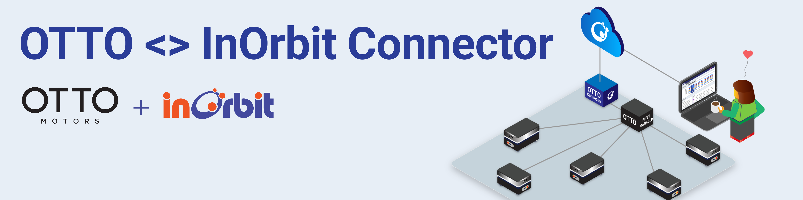

<!--
SPDX-FileCopyrightText: 2023 InOrbit, Inc.

SPDX-License-Identifier: MIT
-->

# OTTO <> InOrbit Connector



## Overview

This repository contains the [InOrbit](https://inorbit.ai/) Robot Connector for [OTTO Motors](https://directory.inorbit.ai/connect/OTTO-Motors) AMRs. Making use of OTTO Fleet Manager's WebSocket and REST APIs as well as InOrbit's [Edge SDK](https://developer.inorbit.ai/docs#edge-sdk), the Connector allows the integration of OTTO robots with your fleet on InOrbit, unlocking interoperability.

This integration requires each robot to be connected to OTTO's Fleet Manager (FM). Once the connection to the FM is established, the Connector needs to be configured following the instructions below. A single instance of the Connector is capable of controlling multiple robots.

## Features

By integrating InOrbit's Python Edge SDK with OTTO's APIs, the Connector unlocks the following key features on InOrbit's platform:

- Visualizing: robot pose, planned path, system and sub-system status, and battery charge.
- Camera feed integration.
- Using [Actions](https://developer.inorbit.ai/docs#configuring-action-definitions) to interact with OTTO's FM by:

  - Dispatching Mission (Job) templates.
  - Controlling Mission status (pause, cancel, retry, etc.).
  - Controlling Autonomy status (pause, resume).
  - Dispatching simple Move-to-place missions.
  - Dispatching maintenance Recipes.

- Running custom shell scripts on the robot via Custom Actions.
- [Mission Tracking](https://developer.inorbit.ai/docs#configuring-mission-tracking) support.

## Requirements

- OTTO's Fleet Manager VM running. Note that its installation process requires direct interaction with OTTO Motors.
- Python 3.7 or later.
- InOrbit account [(it's free to sign up!)](https://control.inorbit.ai/ "InOrbit").

## Setup

In the host machine, clone this repository and create a virtual environment:

```sh
cd src/
virtualenv venv/
. venv/bin/activate
pip install -r requirements.txt
```

Configure the Connector:

- Copy `config/robot-definitions.example.yaml` and add your robots to the list following the instructions in the file.

  - To obtain the `otto_id` value, for each robot:
    1. Open the Fleet Manager dashboard.
    2. Go to `Monitor` > `Fleet`.
    3. Click on the robot's name on the left side panel.
    4. Expand the `Robot Details` section.
    5. Copy the value of the `ID` field.

- Copy `config/example.env` to `config/.env` and set the environment variables following the instructions in the same file.
  You can get the INORBIT_CLI_API_KEY for your account from InOrbit's [Developer Console](https://developer.inorbit.ai/docs#configuring-environment-variables).

## Deployment

Once all dependencies are installed and the configuration is complete, the Connector can be run as a python script.
The entry point is `src/otto_connector.py`:

```sh
# Add the environment variables, activate the virtual environment and run the Connector
export $(grep -v '^#' config/.env | xargs) && \
source src/venv/bin/activate && \
python src/otto_connector.py
```

It is recommended to run the Connector as a service. An example [systemd](https://www.freedesktop.org/software/systemd/man/systemd.service.html) service unit configuration is provided at [`systemd/otto-connector.service`](systemd/otto-connector.service).
In a Debian based system the service can usually be installed and enabled at boot the following way:

```sh
# Copy the unit configuration to the service directory
sudo cp systemd/otto-connector.service /etc/systemd/system/
# Reload the daemon and enable the service
sudo systemctl daemon-reload
sudo systemctl enable otto-connector.service
```

Once the service is installed, it can be restarted with:

```sh
sudo systemctl restart otto-connector.service
```

and its logs can be seen by running:

```sh
sudo journalctl --unit=otto-connector --since=today --follow
```

## Next steps

Now that all of your OTTO robots are InOrbit connected, visit the [config as code examples](cac_examples/README.md)
to apply the configuration needed to unlock the full potential of the OTTO <> InOrbit Connector. Please note that the features available on your account will depend on your [InOrbit Edition](https://www.inorbit.ai/pricing). Don't hesitate to contact [support@inorbit.ai](support@inorbit.ai) for more information.

## Contributing

Any contribution that you make to this repository will be under the MIT license, as dictated by that [license](https://opensource.org/licenses/MIT).


